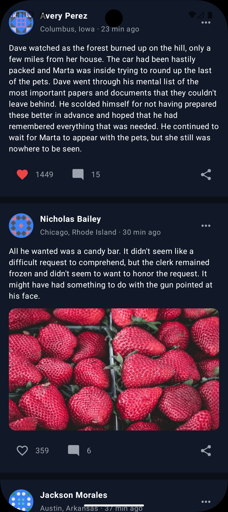

# UwaSocial — Modular Social Media App

An Android social feed application built following **Google's Recommended Architecture**, modern Jetpack Compose UI, offline caching, and Paging 3 integration.

<p align="center">
  
  &nbsp;
  
</p>

---

## 🏛️ Architecture & Module Structure

The project follows Google's recommended architecture principles with strict data encapsulation and multi-module separation:

```
                               ┌─────────────────────────┐
                               │          :app           │
                               └────────────┬────────────┘
                                            │
                               ┌────────────▼────────────┐
                               │     :features:posts     │ (UI / Presentation Layer)
                               └────────────┬────────────┘
                                            │
                               ┌────────────▼────────────┐
                               │         :domain         │ (Use Cases & Domain Models)
                               └──────┬─────────────┬────┘
                                      │             │
                        ┌─────────────▼──┐       ┌──▼──────────────┐
                        │   :data:user   │       │   :data:posts   │ (Data Layer)
                        └─────────────┬──┘       └──┬──────────────┘
                                      │             │
                               ┌──────▼─────────────▼────┐
                               │          :core          │ (General Helpers & Utils)
                               └─────────────────────────┘
```

### Modules Description
* **`:app`**: Application entry point (`UwaSocialApp`), Hilt dependency graph initialization, `MainActivity`, and Baseline Profile rules (`baseline-prof.txt`).
* **`:features:posts`**: Presentation (UI) layer containing Compose components (`PostCard`, `PostHeader`, `PostMedia`, `PostActions`), Shimmer loading animation, Empty, Error, Offline states, and `PostsViewModel`.
* **`:domain`**: Domain layer containing business logic and Use Cases (`GetFeedPostsUseCase`, `ToggleLikePostUseCase`) and domain models (`FeedPost`, `User`).
* **`:data:posts`**: Handles fetching paginated posts from Retrofit API, Room `PostDao`, `RemoteKeyDao`, and `PostRemoteMediator`.
* **`:data:user`**: Handles user profile retrieval from Retrofit API, Room `UserDao`, and user caching.
* **`:core`**: Common utilities, `TimeUtils` (relative time formatting), `NetworkObserver` for connectivity tracking, `AppDispatchers`, and `Modifier.shimmerEffect()`.
* **`:benchmark`**: Macrobenchmark module for measuring cold startup performance, frame timing jank, and generating Baseline Profiles.

---

## ⚡ Baseline Profile & Performance Optimization

To guarantee smooth **60fps / 120fps scrolling** and eliminate first-scroll jank on the feed:
- **Baseline Profile Rules ([`baseline-prof.txt`](file:///C:/Users/jemuveyan/AndroidStudioProjects/UwaSocial/app/src/main/baseline-prof.txt))**: Includes pre-compiled Ahead-Of-Time (AOT) ART rules for `PostsFeedScreen`, `PostCard`, Coil image decoding, Room DB calls, and Compose `LazyColumn` item measurement.
- **Profile Generator ([`BaselineProfileGenerator.kt`](file:///C:/Users/jemuveyan/AndroidStudioProjects/UwaSocial/benchmark/src/main/java/com/bellogate_caliphate/uwasocial/benchmark/BaselineProfileGenerator.kt))**: Automates profile collection using `BaselineProfileRule` in the `:benchmark` module.

---

## 🔄 Combining Data Sources in Repository

A single `FeedPost` presented in the UI requires merging data from 3 distinct sources:

1. **Posts Endpoint (`https://dummyjson.com/posts?limit=10&skip={skip}`)**:
   Provides post content, reaction/like count, view count, and `userId`.
2. **Users Endpoint (`https://dummyjson.com/users/{userId}`)**:
   Provides user full name (`firstName` + `lastName`), avatar URL, and location (`city`, `state`).
3. **Picsum Image Service (`https://picsum.photos/seed/{postId}/600/400`)**:
   Deterministic image URL constructed using `{postId}`. Posts with `postId % 3 != 0` receive an image URL, otherwise `null`.

### Mitigating the N+1 User Fetch Problem
When a page of 10 posts arrives:
1. Unique `userId` values are extracted and deduplicated (`distinct()`).
2. Room database is queried first for cached user profiles.
3. Uncached users are fetched concurrently in parallel using Kotlin Coroutines `async` / `awaitAll`.
4. Fetched users are saved into Room `UserEntity` table and combined with `PostEntity` via Room `@Relation` (`PostWithUserLocal`).

---

## 📑 Pagination Strategy (Paging 3 + `RemoteMediator`)

- Uses Jetpack Paging 3 with a custom `RemoteMediator` (`PostRemoteMediator`).
- **Pagination Keys**: Uses `skip` and `limit`. Initial fetch starts at `skip = 0`.
- **End of Pagination**: `endOfPaginationReached` is dynamically determined when `nextSkip >= response.total` or when the returned list is empty.
- **Single Source of Truth**: Data is persisted into Room DB first, and UI observes Room as a reactive `Flow<PagingData<FeedPost>>`.

---

## 🎨 UI States & Design Specifications

Every requested UI state is implemented according to pixel-accurate design specifications:
* **Feed Screen**: Renders `PostCard` items with avatar initials fallback, location/relative timestamp, body text, Coil media image, and toggleable like count.
* **Shimmer Loading State**: Animated skeleton gradient placeholders matching card structure.
* **Empty State**: Speech bubble icon, *"Nothing here yet"*, and *"Find people to follow"* action button.
* **Error State**: Exclamation mark badge, *"Something went wrong"*, and *"Try again"* retry button.
* **Offline State**: Strikethrough Wi-Fi badge, *"You're offline"*, *"View cached feed"* button, and an active top banner when serving cached offline posts.

---

## 🧪 Unit Testing & UI Testing Strategy

- **MockK Library**: Used for mock creation and verification.
- **Coroutines & Flow Testing**: Tested using `kotlinx-coroutines-test` and `Turbine`.
- **Key Unit Tests**:
  - `UserRepositoryImplTest`: Verifies cached user retrieval and deduplicated remote fetching.
  - `PostRepositoryImplTest`: Verifies domain mapping (`mapToDomainModel`) and like toggle functionality.
  - `PostsViewModelTest`: Verifies `PostsViewModel` state management and like action dispatch.
  - `GetFeedPostsUseCaseTest`: Verifies UseCase delegation to repository flow.
  - `ToggleLikePostUseCaseTest`: Verifies UseCase delegation for post likes.
- **Compose UI Tests & UIAutomation**:
  - `PostCardTest`: Validates UI node rendering of user name, post body, and like count.
  - `FeedUiAutomationTest`: Verifies fetching, scrolling, and displaying feed items.
- **Macrobenchmark**:
  - `StartupBenchmark`: Measures COLD, WARM, and HOT startup timing.
  - `FrameTimingBenchmark`: Measures frame rendering and jank during scrolling.
  - `TimeUtilsMicrobenchmark`: Measures relative time calculation performance.

---

## 🛠️ Production Trade-offs & Future Improvements

1. **GraphQL / Backend Aggregation**:
   In production, user details and post content should be aggregated server-side (BFF pattern or GraphQL) rather than client-side joins.
2. **Optimistic Like Synchronization**:
   Currently, liking a post updates local Room DB instantly. In production, an outbound work queue (`WorkManager`) would sync likes with backend idempotently.
3. **Image Cache Pre-warming**:
   Coil disk cache can be pre-warmed for the next paginated images during background network fetch.
