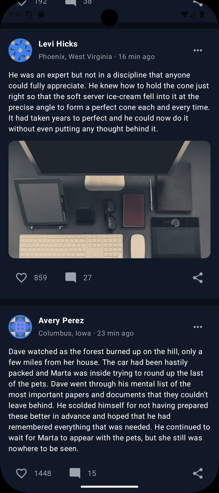

# UwaSocial - A Social Media app

An Android social feed application built following [**Google's Recommended Architecture**](https://developer.android.com/topic/architecture), modern Jetpack Compose UI, offline caching, and Paging 3 integration.

<p align="center">
  
  &nbsp;
  
</p>

---

## 🏛️ Architecture & Module Structure

The project follows Google's recommended architecture principles with strict data encapsulation and multi-module separation:

```
                               ┌─────────────────────────┐
                               │          :app           │
                               └────────────┬────────────┘
                                            │
                               ┌────────────▼────────────┐
                               │     :features:posts     │ (UI / Presentation Layer)
                               └────────────┬────────────┘
                                            │
                               ┌────────────▼────────────┐
                               │         :domain         │ (Use Cases & Domain Models)
                               └──────┬─────────────┬────┘
                                      │             │
                        ┌─────────────▼──┐       ┌──▼──────────────┐
                        │   :data:user   │       │   :data:posts   │ (Data Layer)
                        └─────────────┬──┘       └──┬──────────────┘
                                      │             │
                               ┌──────▼─────────────▼────┐
                               │          :core          │ (General Helpers & Utils)
                               └─────────────────────────┘
```

### Modules Description
* **`:app`**: Application entry point, dependency injection initialization, main activity container, and baseline profile rules.
* **`:features:posts`**: Presentation and UI layer for rendering feed posts, loading indicators, and handling screen user interactions.
* **`:domain`**: Business logic layer containing use cases and domain models for posts and users.
* **`:data:posts`**: Data layer handling post network requests, database storage, and offline caching.
* **`:data:user`**: Data layer handling user profile fetching, database storage, and caching.
* **`:core`**: Shared utilities, network connectivity tracking, coroutine dispatchers, and common UI helpers.
* **`:benchmark`**: Performance macrobenchmarks for measuring startup time, frame timing, and generating baseline profiles.

---

## ⚡ Baseline Profile & Performance Optimization

To guarantee smooth **60fps / 120fps scrolling** and eliminate first-scroll jank on the feed:
- **Baseline Profile Rules ([`baseline-prof.txt`](app/src/main/baseline-prof.txt))**: Includes pre-compiled Ahead-Of-Time (AOT) ART rules for [`PostsFeedScreen`](features/posts/src/main/java/com/bellogate_caliphate/uwasocial/features/posts/ui/screen/PostsFeedScreen.kt), [`PostCard`](features/posts/src/main/java/com/bellogate_caliphate/uwasocial/features/posts/ui/components/PostCard.kt), Coil image decoding, Room DB calls, and Compose `LazyColumn` item measurement.
- **Profile Generator ([`BaselineProfileGenerator.kt`](benchmark/src/main/java/com/bellogate_caliphate/uwasocial/benchmark/BaselineProfileGenerator.kt))**: Automates profile collection using `BaselineProfileRule` in the `:benchmark` module.

---

## 🧪 Unit Testing & UI Testing Strategy

- **MockK Library**: Used for mock creation and verification.
- **Coroutines & Flow Testing**: Tested using `kotlinx-coroutines-test` and `Turbine`.
- **Key Unit Tests**:
  - `UserRepositoryImplTest`: Verifies cached user retrieval and deduplicated remote fetching.
  - `PostRepositoryImplTest`: Verifies domain mapping (`mapToDomainModel`) and like toggle functionality.
  - `PostsViewModelTest`: Verifies `PostsViewModel` state management and like action dispatch.
  - `GetFeedPostsUseCaseTest`: Verifies UseCase delegation to repository flow.
  - `ToggleLikePostUseCaseTest`: Verifies UseCase delegation for post likes.
- **Compose UI Tests & UIAutomation**:
  - `PostCardTest`: Validates UI node rendering of user name, post body, and like count.
  - `FeedUiAutomationTest`: Verifies fetching, scrolling, and displaying feed items.
- **Macrobenchmark**:
  - `StartupBenchmark`: Measures COLD, WARM, and HOT startup timing.
  - `FrameTimingBenchmark`: Measures frame rendering and jank during scrolling.
  - `TimeUtilsMicrobenchmark`: Measures relative time calculation performance.

---

## 🛠️ Production Trade-offs & Future Improvements

1. **GraphQL / Backend Aggregation**:
   In production, user details and post content should be aggregated server-side (BFF pattern or GraphQL) rather than client-side joins.
2. **Optimistic Like Synchronization**:
   Currently, liking a post updates local Room DB instantly. In production, an outbound work queue (`WorkManager`) would sync likes with backend idempotently.
3. **Image Cache Pre-warming**:
   Coil disk cache can be pre-warmed for the next paginated images during background network fetch.
