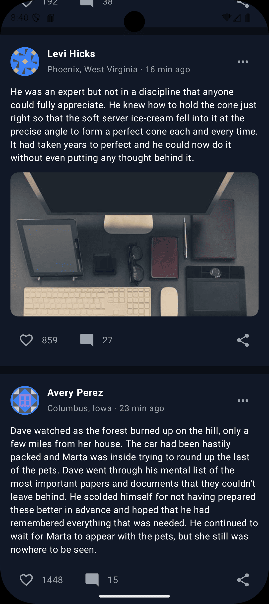
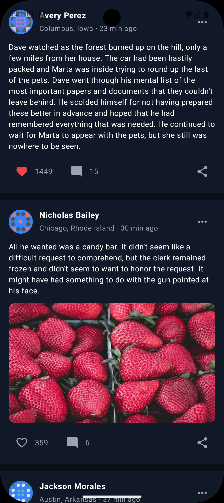

# UwaSocial - Social Feed App

An Android social media feed app built with Jetpack Compose, Room offline caching, Paging 3, and Clean Architecture.

<p align="center">
  
  &nbsp;
  
</p>

---

## ⚙️ How It Works (Data & Offline Strategy)

* **Data & Network Flow**: When the app launches, `PostsViewModel` observes a `PagingData` stream provided by `PostRepository`. Network calls are handled via `Retrofit` and `PostApiService`, fetching paginated post batches from the remote API.
* **Offline Caching & SSOT**: Instead of passing network responses directly to the UI, the app uses Room with `RemoteMediator` as the **Single Source of Truth (SSOT)**. Remote items and `RemoteKeys` are persisted to SQLite. When the device is offline, `Paging 3` seamlessly serves cached posts directly from Room, ensuring uninterrupted scrolling and offline availability.
* **Data Normalization**: Post metadata (`PostEntity`) and author profiles (`UserEntity`) are normalized in local storage and joined via Room `@Transaction` queries (`PostWithUserLocal`), preventing duplicate user records and ensuring consistent author profiles across the feed.

---

## 🏛️ Architecture & Module Structure

```
                               ┌─────────────────────────┐
                               │          :app           │
                               └────────────┬────────────┘
                                            │
                               ┌────────────▼────────────┐
                               │     :features:posts     │ (UI / Presentation Layer)
                               └────────────┬────────────┘
                                            │
                               ┌────────────▼────────────┐
                               │         :domain         │ (Use Cases & Domain Models)
                               └──────┬─────────────┬────┘
                                      │             │
                        ┌─────────────▼──┐       ┌──▼──────────────┐
                        │   :data:user   │       │   :data:posts   │ (Data Layer)
                        └─────────────┬──┘       └──┬──────────────┘
                                      │             │
                               ┌──────▼─────────────▼────┐
                               │          :core          │ (General Helpers & Utils)
                               └─────────────────────────┘
```

* **`:app`**: Application entry point, Hilt DI setup, and baseline profile rules.
* **`:features:posts`**: Compose UI screens, components, and `PostsViewModel`.
* **`:domain`**: Business logic use cases (`GetFeedPostsUseCase`, `ToggleLikePostUseCase`).
* **`:data:posts` & `:data:user`**: Room DB, DAO, Retrofit API services, and `RemoteMediator`.
* **`:core`**: Common utilities, network observers, and shared UI extensions.
* **`:benchmark`**: Macrobenchmarks, Microbenchmarks, and Baseline Profile generator.

---

## 🧪 Testing & Benchmarking Overview

- **Unit Tests**: [`UserRepositoryImplTest`](data/user/src/test/java/com/bellogate_caliphate/uwasocial/data/user/repository/UserRepositoryImplTest.kt), [`PostRepositoryImplTest`](data/posts/src/test/java/com/bellogate_caliphate/uwasocial/data/posts/repository/PostRepositoryImplTest.kt), [`PostsViewModelTest`](features/posts/src/test/java/com/bellogate_caliphate/uwasocial/features/posts/ui/viewmodel/PostsViewModelTest.kt).
- **Compose UI Tests**: [`PostCardTest`](features/posts/src/androidTest/java/com/bellogate_caliphate/uwasocial/features/posts/ui/components/PostCardTest.kt), [`PostsFeedScreenTest`](features/posts/src/androidTest/java/com/bellogate_caliphate/uwasocial/features/posts/ui/components/PostsFeedScreenTest.kt).
- **UIAutomation E2E**: [`FeedUiAutomationTest`](app/src/androidTest/java/com/bellogate_caliphate/uwasocial/FeedUiAutomationTest.kt) for on-device navigation verification.
- **Benchmarks**: [`StartupBenchmark`](benchmark/src/main/java/com/bellogate_caliphate/uwasocial/benchmark/StartupBenchmark.kt), [`FrameTimingBenchmark`](benchmark/src/main/java/com/bellogate_caliphate/uwasocial/benchmark/FrameTimingBenchmark.kt), [`TimeUtilsMicrobenchmark`](benchmark/src/main/java/com/bellogate_caliphate/uwasocial/benchmark/TimeUtilsMicrobenchmark.kt).
